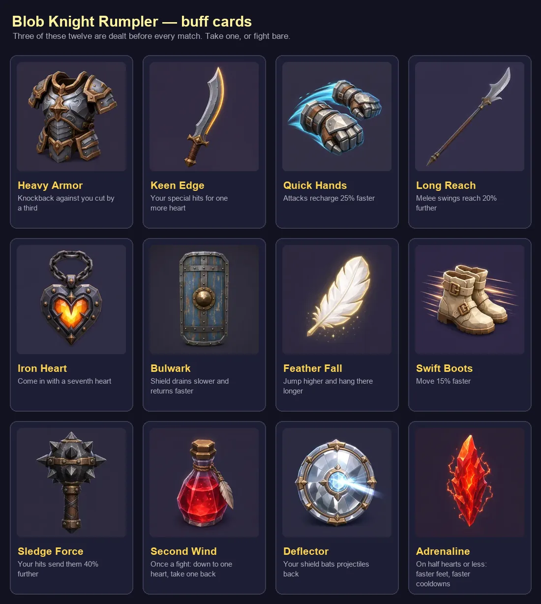

# Buff card art

The twelve cards drafted before a match in **Blob Knight Rumpler**. Generated
with Thrixel (project *Blob Knight Rumpler*, `254f5c0d-4ce4-465e-836c-24b49265c3a6`)
on 2026-09-23 as 512px PNGs, then resized to 256px and encoded as WebP — the
whole deck is about 60 KB, small enough to live inside the page as data URIs so
it works offline in the Android app with nothing to fetch.



`python3 card-art/inline.py` rewrites the `BUFF_ART` block in
`blob-knight-rumpler.html` from these files. Re-run it after replacing any card.

The 512px originals are in `thrixel_assets/blob_knight_rumpler/cards/`, which is
git-ignored like the rest of `thrixel_assets/`. To rebuild one from scratch:
regenerate the image in Thrixel from the prompt below, then

```bash
# 512px png -> the committed 256px webp
python3 -c "from PIL import Image; Image.open('in.png').convert('RGB').resize((256,256), Image.LANCZOS).save('in256.png')"
cwebp -q 80 -m 6 in256.png -o card-art/<name>.webp
python3 card-art/inline.py
```

Every prompt ends with the same tail, which is what keeps the deck one set:
*"…single object centred, chunky stylised low-poly game icon, soft rim light
from above, flat dark slate purple background, no lettering"*.

| card | buff | image id | subject |
|---|---|---|---|
| `armor` | Heavy Armor | `c987a033-40a3-4618-bfbe-28dd36416db2` | heavy ornate steel chest plate |
| `keen` | Keen Edge | `117e72b7-20d8-4a74-8d08-47923727cbc5` | curved blade with a glowing edge |
| `quick` | Quick Hands | `bdc0de80-70eb-42e2-b36c-061dbc1d3219` | gauntlets mid-punch, cyan streaks |
| `reach` | Long Reach | `dd96ebe9-3162-47f8-a0b0-14aa9f1d01c6` | long-hafted steel glaive |
| `ironheart` | Iron Heart | `6e0796c5-0766-402b-92e7-3ada577cf935` | iron heart locket, glowing core |
| `bulwark` | Bulwark | `6efa4873-56fa-41fa-87e8-a0a5ba35b2a3` | tall studded tower shield |
| `feather` | Feather Fall | `865e0495-a6a2-46ae-a9cc-ad8ab45c7d1b` | glowing white feather |
| `boots` | Swift Boots | `8aaacac3-fa54-4608-8a34-3274ef55c699` | leather boots, speed streaks |
| `sledge` | Sledge Force | `0c2fba52-5ac0-4143-8e53-84a2353b3075` | spiked iron mace head |
| `secondwind` | Second Wind | `ac4e3e0e-86c1-46e1-a538-e227cc4468f1` | crimson flask with a feather |
| `deflect` | Deflector | `7cd3c31d-6abb-478d-9a42-63303019182a` | mirror shield throwing back light |
| `adrenaline` | Adrenaline | `81ffdb72-6731-4623-b4da-b039303c10e0` | crackling red crystal shard |
